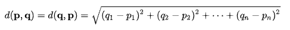

# wsm_project1

usage:
python main.py --query "your query"

e.g. 
python main.py --query "drill wood sharp"

TF

use raw TF (term frequency)

(use the default simple term count model in VectorSpace.py)

IDF

adjust the denominator to 1 + denominator
math.log(len(self.documentVectors) / (1 + denominator))

(see tfidf function in VectorSpace.py)

Euclidean_distance

(see euc_distance in util.py)

other codes are all in main.py

